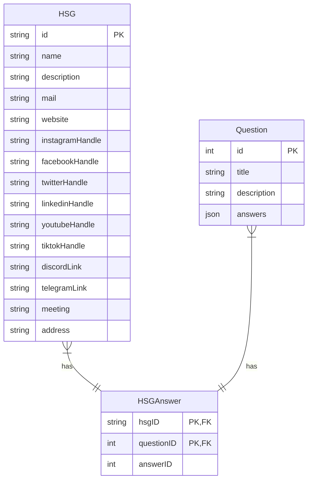

# Datenbank
Da ohnehin ein Editor für die Struktur des Fragebogens und die Hochschulgruppen/Gremien entstehen soll, wird eine Datenbank handlicher sein, als drei einzelne Dateien. Mal schauen was wird.

Die Datenbank ist definiert in [`db/config.ts`](../db/config.ts). In [`db/seed.ts`](../db/seed.ts) sind Testdaten spezifiziert, die während der Entwicklung (`npm run dev`) benutzt werden können.

Für mehr Informationen zum Umgang mit Datenbanken in Astro siehe [Astro Dokumentation](https://astro.build/db/config).

## Schema
